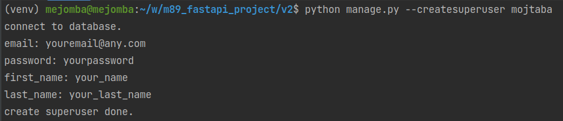

# m89_fastapi_project

## project initialize
>required python3.10

### 1. clone project
`git clone https://github.com/mejomba/m89_fastapi_project.git`
### 2. go to project folder and create python `env`
`cd m89_fastapi_project`

note: you need install virtualenv package on your global python interpreter by
`pip install virtualenv` or `pip3 install virtualenv`

create env for project: `virtualenv env --python=python3.10`

also you can use any other python environment manager like `pipenv` `condaenv` `poetry`
### 3. active `env` and install requirement package
- #### 3.1 activate `env`
  - on linux using `source venv/bin/activate`
  - on window using `venv/Scripts/activate`
- #### 3.2 install requirement package
  - `pip install -r requirement.txt`

### 4. create superuser from commandline (v2)
from commandline (terminal) use `cd v2` go to `v2` directory and run `python manage.py --createsuperuser <username>`
follow the instruction to create superuser like following image

### 5. run the server
open `v2/main.py` file and click on run button

or

from commandline (terminal) go to `v2` directory and run `uvicorn main:app --reload`

